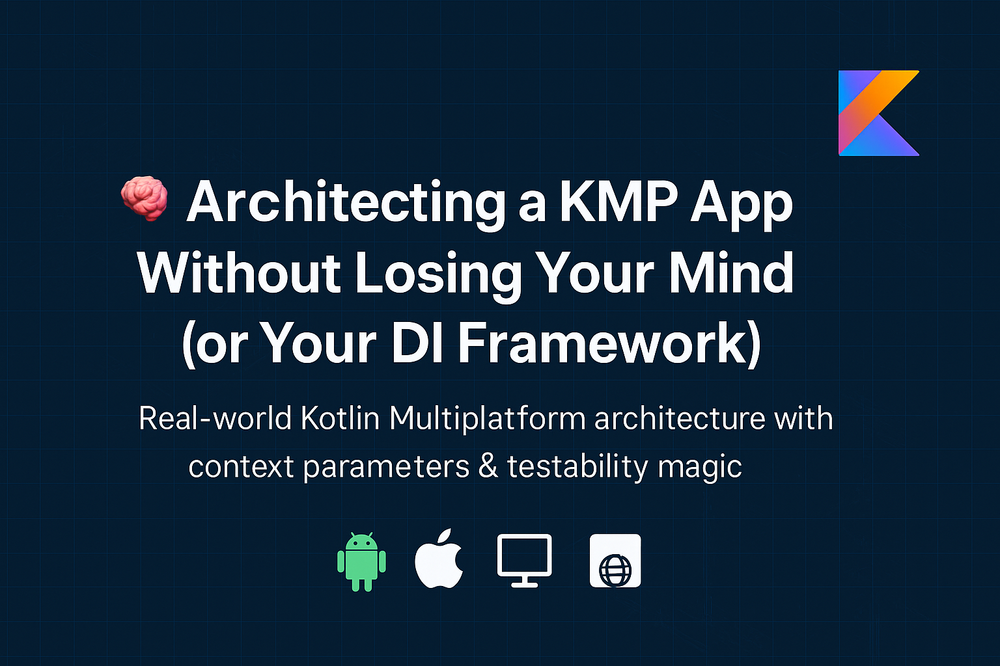

# 🧠 Architecting a KMP App Without Losing Your Mind (or Your DI Framework)

> This playground-repository aims to demonstrate how to structure a real-world Kotlin Multiplatform (KMP) app architecture by walking through a working example that targets all platforms:
> - 📱 Android and iOS
> - 🖥️ Desktop
> - 🌐 Web (via WebAssembly)
>
> By the end of this article, you’ll be able to:
> - Apply **context-based dependency injection** with no DI frameworks
> - Define **modular boundaries** that scale across platforms
> - Write **functional use cases** using Kotlin context parameters
> - Build highly **testable ViewModels and business logic**
>
> This approach will help you structure your KMP codebase to scale cleanly and confidently — whether you're starting a small project or preparing for production.

---

## 🧩 Modules Overview

This project is organized by **responsibility**, not by platform:

- **`domain`** – shared business logic and use cases (as functions!)
- **`data/network`** – Ktor-based network access
- **`data/database`** – Room (Android/iOS) or in-memory (Desktop/Web)
- **`composeApp`** – UI + DI setup via `AppDIScope`, using Jetpack Compose Multiplatform

---

## 💉 Dependency Injection via Context Parameters

No Hilt. No Koin. No magic.

Instead, the app uses **context parameters** (aka `context(...) { ... }`) and **delegated scopes** to wire up the entire dependency graph at the **edge of the app** — not deep inside your core logic.

Example from `AppDIScope`:

```kotlin
override val popularMoviesViewModelFactory: PopularMoviesViewModelFactory by lazy {
  context(threadingScope, networkScope, databaseScope) {
    PopularMoviesViewModelFactory(
      syncMoviesUseCase = { syncMoviesUseCase() },
      syncGenresUseCase = { syncGenresUseCase() },
      observeMoviesUseCase = { observeAllMovies() },
      dispatchers = threadingScope.dispatchers
    )
  }
}
```

This pattern lets you keep your core logic **decoupled**, **testable**, and **simple**.

---

## 🧠 Use Cases as Functions

Instead of bloated "use case classes," use cases are just functions with `context`:

```kotlin
context(NetworkScope, DatabaseScope)
suspend fun syncMoviesUseCase(): Either<NetworkError, Unit> { ... }

context(DatabaseScope)
fun observeAllMovies(): Flow<List<Movie>> { ... }
```

This gives you:
- Clean, composable logic
- Scoped access to only what’s needed
- Easy mocking in tests
- Simple injection with `context(...) { ... }`

---

## 🧪 Testability by Design

Because dependencies are passed via context, and use cases are functions, **everything is testable**:

- ViewModels take use case lambdas and a `DispatcherProvider`
- In-memory databases can replace Room for non-Android tests
- No global singletons or hidden wiring
- You can override dependencies at any level

Example test instantiation:

```kotlin
val viewModel = PopularMoviesViewModel(
  syncMoviesUseCase = { Right(Unit) },
  syncGenresUseCase = { Right(Unit) },
  observeMoviesUseCase = { flowOf(fakeMovies) },
  dispatchers = TestDispatcherProvider()
)
```

---

## 🧑‍🎨 UI Layer: ViewModels Like DSLs

Your ViewModel factories (`PopularMoviesViewModelFactory`, `MovieDetailsViewModelFactory`) encapsulate dependencies as **function parameters**, enabling flexible construction across platforms.

With Compose Multiplatform, the same UI logic powers Android, Desktop, and Web, and you can wire up each ViewModel cleanly:

```kotlin
val viewModel = viewModel<PopularMoviesViewModel>(
  factory = popularMoviesViewModelFactory.create()
)
```

This clean separation makes your app architecture feel **like a well-written DSL**.

---

## 🧠 KMP Superpowers You Get for Free

By structuring your app this way, you unlock the full power of KMP:

- ✅ Shared logic across all targets
- ✅ Consistent architecture regardless of platform
- ✅ Compose UI on Android, Desktop, Web — with native SwiftUI or UIKit possible on iOS
- ✅ Coroutine-based networking via Ktor
- ✅ Shared `Flow` streams and immutable state models

Even though this app just fetches movie data, the **foundation scales** to full production apps.

---

## ✅ Why This Architecture Works

- It’s **functional**: use cases are scoped functions, not classes.
- It’s **explicit**: dependencies are passed, not hidden.
- It’s **testable**: every layer can be mocked or stubbed.
- It’s **scalable**: modules and boundaries make sense.
- It’s **KMP-native**: works across all targets with no hacks.

---

## 🧪 Bonus: Fast Testing Across Targets

Because of in-memory or pluggable database implementations and context-scoped dependencies, you can write fast, focused tests for any target:

```kotlin
@Test
fun syncMovies_shouldReturnSuccess() = runTest {
    context(FakeNetworkScope(), FakeDatabaseScope()) {
      val result = syncMoviesUseCase()
      assertTrue(result.isRight())
    }
  }
```

This flexibility means your test suite doesn't need to change when you move from mobile to web or desktop.

---

## ✨ Final Thoughts

Even a simple KMP app can have **great architecture** — and that architecture will carry you into the future.

By embracing:
- **Context parameters**
- **Functional use cases**
- **Scoped ViewModel factories**
- **Proper modularization**

...you get a codebase that’s testable, adaptable, and a joy to work on.

---

## 📌 Recap: What You Can Do Today

✅ Set up your KMP project with modular boundaries  
✅ Use context-based functions instead of DI frameworks  
✅ Build reusable ViewModel factories per feature  
✅ Write testable business logic without platform dependencies  
✅ Share code confidently across Android, iOS, Desktop, and Web

Want to try it out? just plug in your TheMovieDb API key [here](org.danieh.tmdb.data.network.HttpClientKt.getHttpClient) and run it anywhere: Android, iOS, Web, or Desktop.
